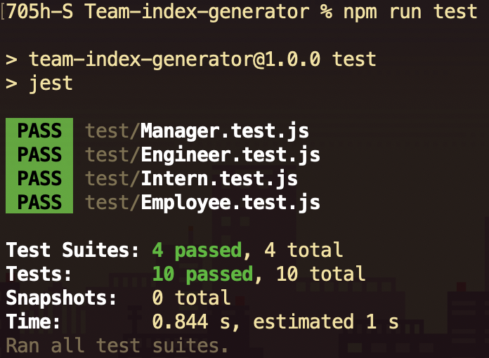

# Team-index-generator

---

| Table of contents                       |
| --------------------------------------- |
| [Technologies Used](#Technologies-Used) |
| [Description](#Description)             |
| [Installtion](#Installtion)             |
| [Walk-Through](#Walk-Through)           |
| [Images](#Images)                       |
| [Author](#Author)                       |

---

## Technologies Used

- [Node](https://nodejs.dev/)
- [Inquirer.js](https://www.npmjs.com/package/inquirer)
- [Jest](https://www.npmjs.com/package/jest)

---

## Description

A command-line application that takes in information about employees then generates an index.html webpage that displays summaries for each person. The index.html is dynamically generated using the Inquirer. Using Jest I was able to perform test.

---

## Installtion

Before cloning down this repo make sure your [Node](https://nodejs.dev/) is up to date.

Once you have cloned down the repo and are on the correct dictionary on your terminal type in these following commands.

```
npm i
```

> To install all Node Modules

```
npm run test
```

> To test suits using Jest

```
npm run start
```

> To Run the application

---

## Walk-Through

Video of application running along with test of application.
<br>
[Walkthrough](#)

---

## Images

> Inquirer prompts with my response


> With User response it'll then render an index.html page that looks like this


> Here's a code snippit of one of the suits we are testing.

```javascript
describe("Engineer object", () => {
  // What should it do?
  it("Should create an object of github with the parameters of parent", () => {
    // Arange
    const name = "Josh";
    const id = 1;
    const email = "fakeemail@gmail.com";
    const gitHub = "705h-S";
    // Act
    const en = new Engineer(name, id, email, gitHub);
    // Assert
    expect(en.github).toEqual(gitHub);
  });

```

> Here are the results after `npm run test` has been run.



---

## Author

#### Joshua Meza

[GitHub](https://github.com/705h-S) <br>
[linkedin](https://www.linkedin.com/in/joshua-meza-918b77224/)
